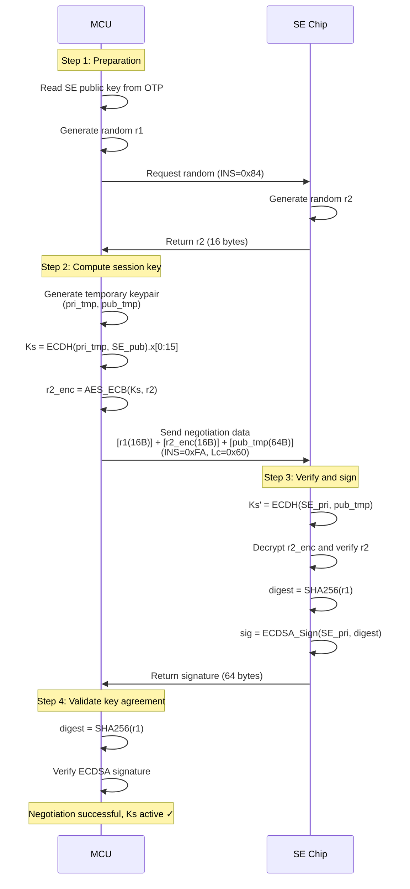

# OneKey THD89 SE Command Reference

> **Scope**: BTC black-box verification of the THD89 Secure Element. Only Bitcoin-relevant runtime commands are included. Factory provisioning commands and non-BTC chain operations are omitted.

---

## 1. Communication Interface

- **Physical protocol**: I2C
- **Transport capability**: Maximum TX/RX data length **1024 bytes**

---

## 2. MCU–SE Key Agreement Protocol

### 2.1 Overview

Encrypted communication between the MCU and the SE (Secure Element) uses **ECDH** to negotiate a session key.

- **Factory provisioning**: The SE generates and provisions its key pair. The MCU reads the SE public key and stores it in OTP (One-Time Programmable) memory.
- **Security constraint**: After manufacturing, the SE public key can no longer be read.

### 2.2 Key Agreement Procedure

#### Step 1: Preparation

1. The MCU reads the SE static public key (`SE_pubkey`) from OTP.
2. The MCU generates a 16-byte random value `r1`.
3. The MCU requests and obtains a 16-byte random value `r2` from the SE.

#### Step 2: Compute Session Key and Send Request

1. The MCU generates a temporary ECDSA key pair (curve `secp256k1`):
   - Temporary private key `prikey_tmp` (32 bytes)
   - Temporary public key `pubkey_tmp` (65 bytes, uncompressed format: `0x04` + 64-byte coordinates)
2. The MCU computes the ECDH session key:

   ```text
   session_tmp = ECDH(prikey_tmp, SE_pubkey)
   Ks = session_tmp.x[0:15]  // Take the first 16 bytes of the shared point X coordinate as the session key
   ```

3. The MCU encrypts the SE random value `r2` using the session key `Ks`:

   ```text
   r2_enc = AES128-ECB(Ks, r2)
   ```

4. The MCU constructs the key agreement APDU and sends it:
   - **APDU header**: `CLA=0x00, INS=0xFA, P1=0x00, P2=0x00, Lc=0x60`
   - **Data field**: `[r1 (16 bytes)] + [r2_enc (16 bytes)] + [pubkey_tmp (64 bytes, without 0x04 prefix)]`

#### Step 3: SE Verifies and Returns Signature

After receiving the data, the SE performs:

1. Compute ECDH using the SE private key and the MCU temporary public key `pubkey_tmp`, deriving `Ks'`.
2. Decrypt `r2_enc` using `Ks'` and verify the plaintext equals the internally stored `r2`.
3. If verification succeeds, compute the digest of `r1`: `digest = SHA256(r1)`.
4. Sign `digest` using the SE private key (ECDSA).
5. Return the 64-byte signature to the MCU.

#### Step 4: MCU Validates Key Agreement

After receiving the signature, the MCU:

1. Computes `digest = SHA256(r1)`.
2. Verifies the signature using the SE public key.
3. If verification succeeds, the key agreement is successful and session key `Ks` is established.

### 2.3 Secure Messaging for Subsequent Traffic

After a successful negotiation, subsequent communication is protected using `Ks`:

1. **IV generation**: Before each transaction, the MCU obtains a 16-byte random IV from the SE (transported encrypted under the session key).
2. **Data encryption**: Encrypt the payload using `AES-128-CBC` (ISO/IEC 7816-4 padding: append `0x80` then `0x00` bytes until the block boundary).
3. **Request MAC**: Compute `AES-CBC-MAC` over `[APDU header + encrypted data]` (4 bytes).
4. **Request format**: `[APDU header][AES-CBC encrypted data][MAC (4 bytes)]`
5. **Response MAC**: Compute `AES-CBC-MAC` over `[encrypted data]` only (4 bytes). Note: the response MAC does **not** include the APDU header, unlike the request MAC.
6. **Response format**: `[AES-CBC encrypted data][MAC (4 bytes)][SW1SW2]`

### 2.4 Sequence Diagram



---

## 3. Command Set (APDU)

> **Note**:
>
> 1. Standard commands use `CLA=0x00` or `0x80`.
> 2. Secure messaging uses `CLA=0x84`, and the packet ends with a 4-byte MAC.

### 3.1 System & Basic Commands

| Description | CLA | INS | P1 | P2 | Data / Notes |
|:---|:---:|:---:|:---:|:---:|:---|
| **Get random** | `00` | `84` | `00` | `00` | `Lc=2`: length (2 bytes, big-endian) → returns random bytes of the specified length |
| **Get random (CBC encrypted)** | `84` | `84` | `00` | `00` | Get random under secure channel, response AES-CBC encrypted |
| **Get random (ECB encrypted)** | `A4` | `84` | `00` | `00` | Get random under secure channel, response AES-ECB encrypted (no IV needed) |
| **Reset device** | `00` | `F0` | `00` | `00` | Reset the SE and reboot to the main application |
| **Power-on key synchronization** | `00` | `FA` | `00` | `00` | `Lc=0x60`: `[r1(16B)] + [r2_enc(16B)] + [pubkey_tmp(64B)]` → returns signature over r1 (64B) |
| **Get current SE state** | `80` | `CA` | `00` | `00` | Returns: `0x00`=Boot mode, `0x55`=App mode |
| **Switch to Boot** | `80` | `FC` | `00` | `FF` | Exit app mode, return to Bootloader |

### 3.2 Device Information & Version

| Description | CLA | INS | P1 | P2 | Data / Notes |
|:---|:---:|:---:|:---:|:---:|:---|
| **Read serial number** | `00` | `F5` | `00` | `00` | → returns serial number |
| **Read device public key** | `00` | `F5` | `00` | `01` | → returns public key (64 bytes) |
| **Read device certificate** | `00` | `F5` | `00` | `02` | → returns certificate |
| **Sign with device private key** | `00` | `F5` | `00` | `03` | `Lc=0x20`: message (32B) → returns signature (64B) |
| **Get version information** | `00` | `F7` | `00` | `00` | → returns version string |
| **Get build ID** | `00` | `F7` | `00` | `01` | → returns build ID (7 bytes) |
| **Get firmware hash** | `00` | `F7` | `00` | `02` | → returns SHA256 (32 bytes) |
| **Get Boot version** | `00` | `F7` | `00` | `03` | → returns Boot version string |
| **Get Boot build ID** | `00` | `F7` | `00` | `04` | → returns Boot build ID |
| **Get Boot hash** | `00` | `F7` | `00` | `05` | → returns Boot SHA256 (32 bytes) |
| **Query initialization status** | `00` | `F8` | `00` | `00` | → `0x55`=initialized, `0x00`=not initialized |
| **Get product mode** | `00` | `F8` | `04` | `00` | → `0x55`=product mode, `0x00`=factory mode |

### 3.3 Mnemonics & Data Management

| Description | CLA | INS | P1 | P2 | Data / Notes |
|:---|:---:|:---:|:---:|:---:|:---|
| **Import mnemonic** | `84` | `E2` | `00` | `00` | `Lc=len`: BIP39 mnemonic string |
| **Verify stored mnemonic** | `84` | `E2` | `00` | `01` | `Lc=len`: mnemonic string → verifies input matches the stored mnemonic, returns `0x55`=match, `0x00`=mismatch (unlock required) |
| **Set Backup flag** | `84` | `E2` | `00` | `03` | `Lc=1`: `0x01`=backup required, `0x00`=no backup required |
| **Get Backup flag** | `84` | `E2` | `00` | `04` | → returns `0x01`=backup required, `0x00`=no backup required |
| **Import SLIP39 mnemonic** | `84` | `E2` | `00` | `05` | `Lc=len`: SLIP39 mnemonic info structure |
| **Read public data** | `84` | `E3` | `00` | `00` | `Lc=4`: `[Offset(2B)] + [Len(2B)]` → returns data |
| **Read private data** | `84` | `E3` | `00` | `01` | `Lc=4`: `[Offset(2B)] + [Len(2B)]` → returns data (unlock required) |
| **Write public data** | `84` | `E4` | `00` | `00` | `Lc=4+len`: `[Offset(2B)] + [Len(2B)] + [Data]` |
| **Write private data** | `84` | `E4` | `00` | `01` | `Lc=4+len`: `[Offset(2B)] + [Len(2B)] + [Data]` (unlock required) |
| **Wipe device** | `84` | `E1` | `00` | `00` | `Lc=0x10`: 16 bytes (content is not validated; only the session key establishment and correct Lc are required) |

### 3.4 PIN & Security

| Description | CLA | INS | P1 | P2 | Data / Notes |
|:---|:---:|:---:|:---:|:---:|:---|
| **Has PIN** | `84` | `E5` | `00` | `00` | → returns `0x55`=set, `0x00`=not set |
| **Set PIN** | `84` | `E5` | `00` | `01` | `Lc=Len+1`: `[Len(1B)] + [PIN]` (PIN length: 4–50 bytes) |
| **Change PIN** | `84` | `E5` | `00` | `02` | `Lc=OldLen+NewLen+2`: `[OldLen(1B)] + [OldPIN] + [NewLen(1B)] + [NewPIN]` (PIN length: 0–50 bytes, 0 means no pin) |
| **Verify PIN** | `84` | `E5` | `00` | `03` | `Lc=Len+1` or `Len+2`: `[Len(1B)] + [PIN] + [Type(1B, optional)]` → returns status. Type values: `0`=user PIN (default), `1`=user PIN check, `2`=user+passphrase PIN, `3`=passphrase PIN, `4`=passphrase PIN check, `5`=user+passphrase PIN check |
| **Get PIN lock state** | `84` | `E5` | `00` | `04` | → returns `0x55`=unlocked, `0x00`=locked |
| **Get PIN remaining attempts** | `84` | `E5` | `00` | `05` | → returns remaining retry count (1 byte) |
| **Lock PIN** | `84` | `E5` | `00` | `06` | Lock the device immediately |
| **Has wipe code** | `84` | `E5` | `00` | `07` | → returns `0x55`=set, `0x00`=not set |
| **Change wipe code** | `84` | `E5` | `00` | `08` | `Lc=PinLen+WipeLen+2`: `[PinLen(1B)] + [PIN] + [WipeLen(1B)] + [WipeCode]` |
| **Set Passphrase PIN** | `84` | `E5` | `00` | `09` | `Lc=PinLen+PassPinLen+PassLen+3`: `[PinLen] + [PIN] + [PassPinLen] + [PassPIN] + [PassLen] + [Passphrase]` → returns result |
| **Delete Passphrase PIN** | `84` | `E5` | `00` | `0A` | `Lc=PassPinLen+1`: `[PassPinLen(1B)] + [PassPIN]` → returns result |
| **Check Passphrase address** | `84` | `E5` | `00` | `0B` | `Lc=AddrLen+1`: `[AddrLen(1B)] + [Address]` → returns `0x55`=exists, `0x00`=does not exist |
| **Get Passphrase capacity** | `84` | `E5` | `00` | `0C` | → returns remaining capacity (1 byte) |
| **Get Passphrase overwrite flag** | `84` | `E5` | `00` | `0D` | → returns `0x01`=overwrite allowed, `0x00`=not allowed |
| **Change Passphrase PIN** | `84` | `E5` | `00` | `0E` | `Lc=OldLen+NewLen+2`: `[OldLen(1B)] + [OldPIN] + [NewLen(1B)] + [NewPIN]` |

### 3.5 Session & Seed

| Description | CLA | INS | P1 | P2 | Data / Notes |
|:---|:---:|:---:|:---:|:---:|:---|
| **Start session** | `84` | `E6` | `00` | `00` | Create a new session → returns SessionID (32 bytes) |
| **Open session** | `84` | `E6` | `00` | `01` | `Lc=0x20`: SessionID (32B) → returns SessionID (32B) |
| **Close current session** | `84` | `E6` | `00` | `02` | Close the currently opened session |
| **Clear session** | `84` | `E6` | `00` | `03` | Close all sessions |
| **Get session cache state** | `84` | `E6` | `00` | `04` | → returns state: `0x80`=seed present, `0x40`=Cardano seed present, `0x00`=none |
| **Generate session seed** | `84` | `E6` | `00` | `05` | `Lc=len`: Passphrase string → generate master seed |
| **Get session state** | `84` | `E6` | `00` | `07` | → returns `0x55`=session open, `0x00`=no session |
| **Get session type** | `84` | `E6` | `00` | `09` | → returns session type (1 byte) |
| **Get current session ID** | `84` | `E6` | `00` | `0A` | → returns current SessionID (32 bytes) |
| **Seed generation progress** | `80` | `E6` | `00` | `08` | Get seed generation progress (compact) |

### 3.6 Key Derivation

| Description | CLA | INS | P1 | P2 | Data / Notes |
|:---|:---:|:---:|:---:|:---:|:---|
| **Derive BIP32 node** | `84` | `E7` | `00` | `00` | `Lc=1+CurveLen+PathLen`: `[CurveLen(1B)] + [CurveName(string)] + [Path(4B×N)]` → returns `[Fingerprint(4B)] + [HDNode]` (unlock required). Curve is an ASCII string (e.g. `"secp256k1"`=9 bytes). Max path depth: 8 levels. HDNode contains: depth, child_num, chain_code, public_key (private_key is zeroed). |

### 3.7 Signing

| Description | CLA | INS | P1 | P2 | Data / Notes |
|:---|:---:|:---:|:---:|:---:|:---|
| **HDNode sign digest** | `84` | `E8` | `00` | `00` | `Lc=0x20`: Digest (32B) → returns signature (65B, unlock required) |
| **ECDSA sign digest** | `84` | `E8` | `00` | `01` | `Lc=0x22`: `[Curve(1B)] + [IsCanonical(1B)] + [Digest(32B)]` → returns signature (65B, unlock required). Curve: `0x00`=nist256p1, `0x01`=secp256k1. IsCanonical: `0`=no canonicalization (BTC), `1`=Ethereum, `2`=EOS |
| **BIP340 tweak private key** | `84` | `E8` | `00` | `06` | `Lc=0x20` or `0x00`: RootHash (32B, optional) → tweak private key (unlock required) |
| **BIP340 sign digest** | `84` | `E8` | `00` | `07` | `Lc=0x20`: Digest (32B) → returns Schnorr signature (64B, unlock required) |
| **BCH Schnorr sign** | `84` | `E8` | `00` | `09` | `Lc=0x20`: Digest (32B) → returns BCH Schnorr signature (64B, unlock required) |

### 3.8 ECDH Key Exchange

| Description | CLA | INS | P1 | P2 | Data / Notes |
|:---|:---:|:---:|:---:|:---:|:---|
| **ECDSA ECDH** | `84` | `E9` | `00` | `00` | `Lc=0x40`: peer public key (64B) → returns shared secret (unlock required) |

### 3.9 SLIP21 Key Derivation

| Description | CLA | INS | P1 | P2 | Data / Notes |
|:---|:---:|:---:|:---:|:---:|:---|
| **SLIP21 root node** | `84` | `EB` | `00` | `00` | → returns root node (64B, unlock required) |

### 3.10 CoinJoin Authorization

| Description | CLA | INS | P1 | P2 | Data / Notes |
|:---|:---:|:---:|:---:|:---:|:---|
| **Set authorization data** | `84` | `EC` | `00` | `00` | `Lc=4+len`: `[Type(4B)] + [Data]` |
| **Get authorization type** | `84` | `EC` | `00` | `01` | → returns type (4 bytes) |
| **Get authorization data** | `84` | `EC` | `00` | `02` | → returns authorization data |
| **Clear authorization** | `84` | `EC` | `00` | `03` | Clear all authorization data |

---

## Appendix A: Status Codes (SW1SW2)

| Code | Meaning |
|:---:|:---|
| `0x9000` | Success |
| `0x6A86` | Incorrect P1/P2 |
| `0x6700` | Incorrect Lc (data length) |
| `0x6C00` | Incorrect Le (expected length) |
| `0x6D00` | Incorrect INS |
| `0x6E00` | Incorrect CLA |
| `0x6A80` | Incorrect data |
| `0x6A87` | Incorrect P3 |
| `0x6982` | Security status not satisfied (e.g. PIN not verified) |
| `0x6985` | Conditions not satisfied |
| `0x6F00` | Execution error |
| `0x6F80` | Wipe code entered (device will be wiped) |
| `0x6901` | Data padding error |
| `0x6902` | Data MAC error |
| `0x6900` | Firmware too long (boot mode only) |
| `0x6903` | Response length too long |

---

## Appendix B: Data Encoding Conventions

### BIP32 Path Encoding

Each path level is a **4-byte little-endian** `uint32`. Hardened derivation is indicated by setting the highest bit:

```text
hardened index = index | 0x80000000
```

Example: `m/44'/0'/0'/0/0`

```text
[2C000080] [00000080] [00000080] [00000000] [00000000]
  44'          0'         0'         0          0
```

### Curve Identifier (ECDSA sign digest only)

These numeric identifiers apply **only** to `ECDSA sign digest` (INS=0xE8, P2=0x01). For `BIP32 derive` (INS=0xE7, P2=0x00), the curve is specified as an **ASCII string** (e.g. `"secp256k1"` = 9 bytes), prefixed by a 1-byte length field.

| Value | Curve |
|:---:|:---|
| `0x00` | NIST P-256 (nist256p1) |
| `0x01` | secp256k1 (Bitcoin) |

### Signature Format (65 bytes)

```text
[v (1B)] + [r (32B)] + [s (32B)]
```

Where `v` is the recovery ID. BIP340 Schnorr signatures return 64 bytes (`r + s`, no recovery ID).

